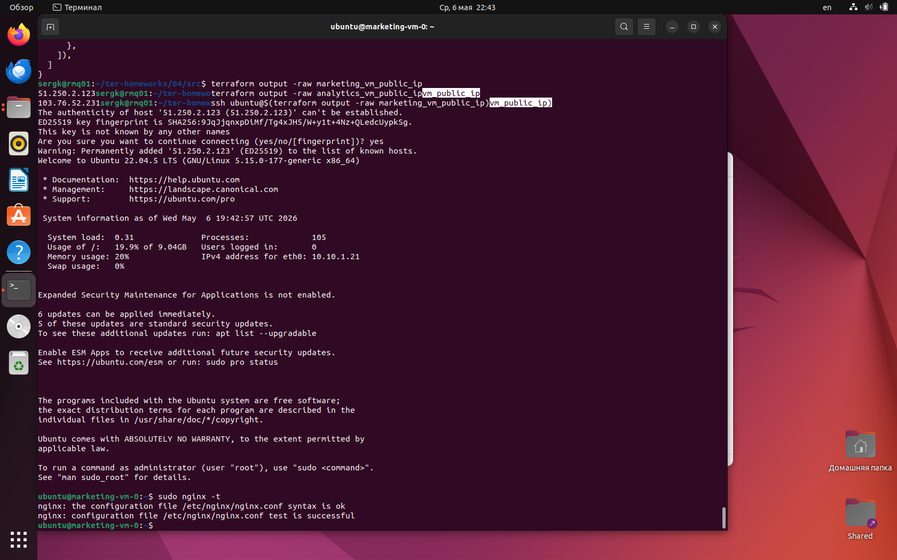
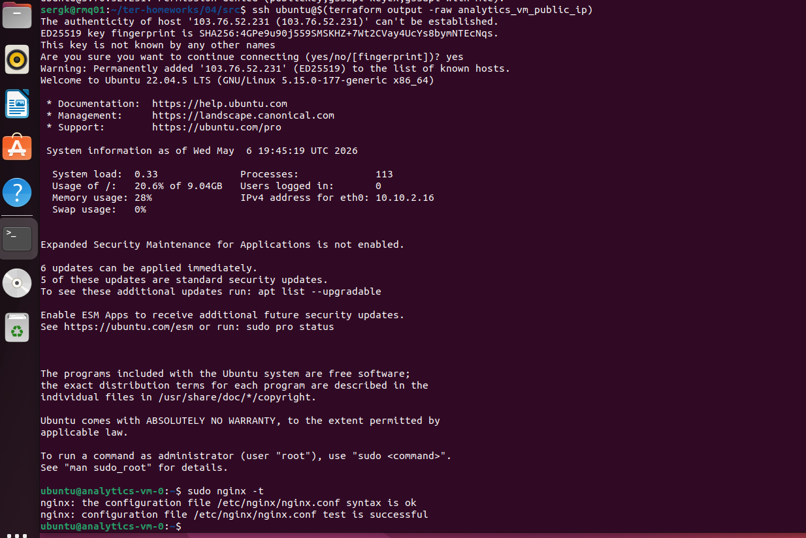
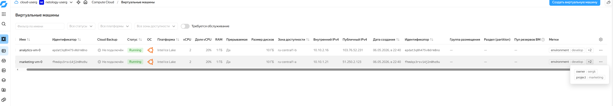
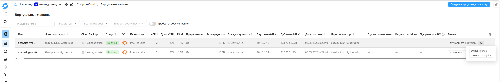
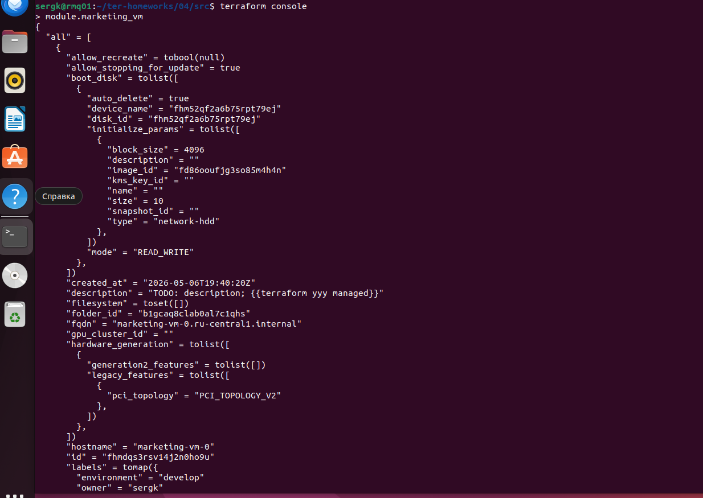
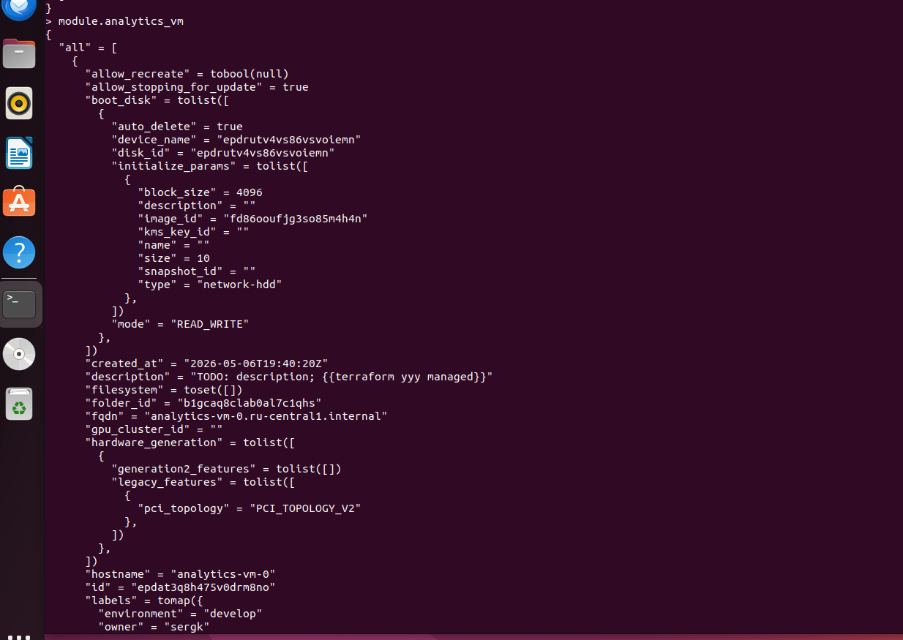
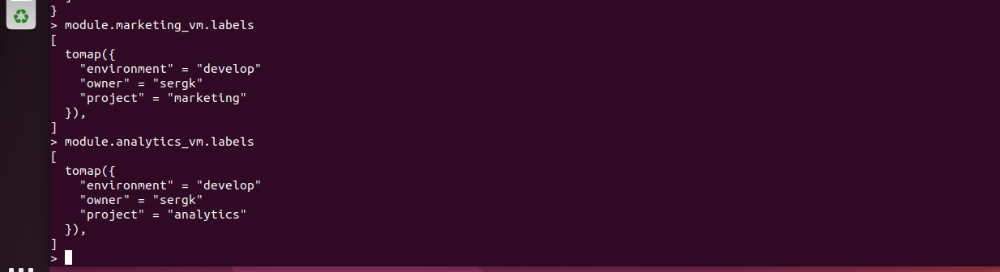

# Домашнее задание к занятию «Продвинутые методы работы с Terraform»

## Задание 1

1.Возьмите из демонстрации к лекции готовый код для создания с помощью двух вызовов remote-модуля -> двух ВМ, относящихся к разным проектам(marketing и analytics) используйте labels для обозначения принадлежности. В файле cloud-init.yml необходимо использовать переменную для ssh-ключа вместо хардкода. Передайте ssh-ключ в функцию template_file в блоке vars ={} . Воспользуйтесь примером. Обратите внимание, что ssh-authorized-keys принимает в себя список, а не строку.  
2.Добавьте в файл cloud-init.yml установку nginx.  
3.Предоставьте скриншот подключения к консоли и вывод команды sudo nginx -t, скриншот консоли ВМ yandex cloud с их метками. Откройте terraform console и предоставьте скриншот содержимого модуля. Пример: > module.marketing_vm  

## Решение 1

1. Создана новая ветка `terraform-04`.
2. Код из демонстрации к лекции адаптирован под два вызова remote-модуля `git::https://github.com/udjin10/yandex_compute_instance.git?ref=main`.
3. Созданы две виртуальные машины:
   - `marketing-vm-0`, проект `marketing`;
   - `analytics-vm-0`, проект `analytics`.
4. Для обозначения принадлежности ВМ к проектам добавлены `labels`:
   - `project = "marketing"`;
   - `project = "analytics"`.
5. В `cloud-init.yml` SSH-ключ передаётся через переменную `${ssh_public_key}`, а не хранится хардкодом.
6. В `cloud-init.yml` добавлена установка и запуск `nginx`.


### Передача SSH-ключа в cloud-init через template_file

```hcl
data "template_file" "cloudinit" {
  template = file("${path.module}/cloud-init.yml")

  vars = {
    instance_user  = var.instance_user
    ssh_public_key = var.ssh_public_key
  }
}
```

### Фрагмент cloud-init.yml

```yaml
#cloud-config
users:
  - name: ${instance_user}
    groups: [sudo]
    shell: /bin/bash
    sudo: ["ALL=(ALL) NOPASSWD:ALL"]
    ssh-authorized-keys:
      - ${ssh_public_key}

package_update: true
package_upgrade: false
packages:
  - nginx

runcmd:
  - systemctl enable nginx
  - systemctl restart nginx
```

### Метки ВМ marketing

```hcl
labels = {
  owner       = var.owner
  environment = var.env_name
  project     = "marketing"
}
```

### Метки ВМ analytics

```hcl
labels = {
  owner       = var.owner
  environment = var.env_name
  project     = "analytics"
}
```

### Скриншоты

1. Подключение к marketing VM и проверка nginx



2. Подключение к analytics VM и проверка nginx



3. ВМ в консоли Yandex Cloud с меткой project=marketing



4. ВМ в консоли Yandex Cloud с меткой project=analytics



5. Terraform console: module.marketing_vm



6. Terraform console: module.analytics_vm



7. Terraform console: отдельно labels



---

## Задание 2

1.Напишите локальный модуль vpc, который будет создавать 2 ресурса: одну сеть и одну подсеть в зоне, объявленной при вызове модуля, например: ru-central1-a.  
2.Вы должны передать в модуль переменные с названием сети, zone и v4_cidr_blocks.  
3.Модуль должен возвращать в root module с помощью output информацию о yandex_vpc_subnet. Пришлите скриншот информации из terraform console о своем модуле. Пример: > module.vpc_dev  
4.Замените ресурсы yandex_vpc_network и yandex_vpc_subnet созданным модулем. Не забудьте передать необходимые параметры сети из модуля vpc в модуль с виртуальной машиной.  
5.Сгенерируйте документацию к модулю с помощью terraform-docs.  

Пример вызова

module "vpc_dev" {
  source       = "./vpc"
  env_name     = "develop"
  zone = "ru-central1-a"
  cidr = "10.0.1.0/24"
}


## Решение 2


Создан локальный модуль `vpc`, который создаёт:

- `yandex_vpc_network`
- `yandex_vpc_subnet`

В модуль передаются:

- `network_name`
- `zone`
- `v4_cidr_blocks`

Модуль возвращает информацию о подсети через output `subnet`.

В root module ресурсы `yandex_vpc_network` и `yandex_vpc_subnet` заменены вызовом локального модуля:

```hcl
module "vpc_dev" {
  source = "./vpc"

  env_name       = var.env_name
  network_name   = "${var.env_name}-network"
  zone           = var.default_zone
  v4_cidr_blocks = var.default_cidr
}

### Terraform console


Документация к модулю сгенерирована командой: terraform-docs markdown table ./vpc > ./vpc/README.md
и находится в папке 04/src/vpc/README.md
